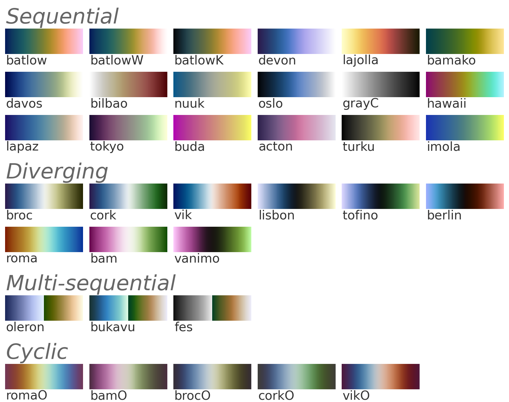

# cmcrameri


[](https://www.repostatus.org/#active)


 [](https://pepy.tech/project/cmcrameri)

 [](https://anaconda.org/conda-forge/cmcrameri)


This is a Python wrapper around Fabio Crameri's perceptually uniform colormaps.

<https://www.fabiocrameri.ch/colourmaps/>

All credit for creating the colormaps to Fabio.
Any errors in the Python implementation of colormaps are my own.

This version is based on _Scientific colour maps_ [version 8.0](https://doi.org/10.5281/zenodo.8035877) (2023-06-14).

## Install

With `pip`:

```sh
python -m pip install cmcrameri
```

With `conda`:

```sh
conda install -c conda-forge cmcrameri
```

## Usage example

```python
import cmcrameri.cm as cmc
import matplotlib.pyplot as plt
import numpy as np

x = np.linspace(0, 1, 100)[np.newaxis, :]

plt.imshow(x, aspect='auto', cmap=cmc.batlow)
plt.axis('off')
plt.show()
```

For a discretized colormap like batlow split into 25 levels, you can use the [`.resampled`](https://matplotlib.org/stable/api/_as_gen/matplotlib.colors.ListedColormap.html#matplotlib.colors.ListedColormap.resampled) method on any of the colormaps:

```
plt.imshow(x, aspect='auto', cmap=cmc.batlow.resampled(25))
```

Alternatively, the registered name string can be used.

```python
import cmcrameri # required in order to register the colormaps with Matplotlib
...
plt.imshow(x, aspect='auto', cmap='cmc.batlow')
```

## Extra instructions

You can access all the core colormaps from Fabio Crameri's list by `cmcrameri.cm.<colormapname>`.

You can use tab autocompletion on `cmcrameri.cm` if your editor supports it.

For a reversed colormap, append `_r` to the colormap name.

Categorical colormaps have the suffix `S`.

For an image of all the available colormaps without leaving the comfort of your Python session:

```python
from cmcrameri import show_cmaps

show_cmaps()
```



The original colormap text files are shipped as part of the package.
Find them on your system with:

```python
from cmcrameri.cm import paths

paths
```

## License

This work is licensed under an [MIT license](https://mit-license.org/).
